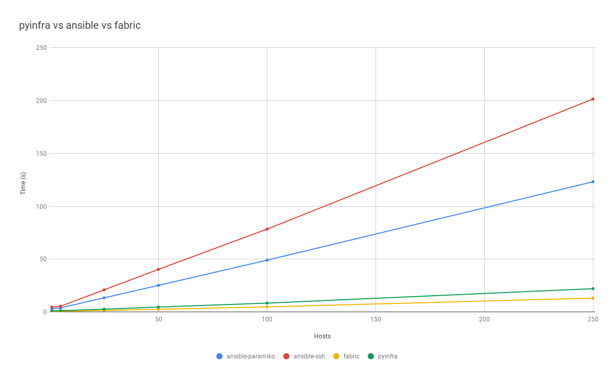

# pyinfra Performance Comparison

This repo aims to compare the peformance of pyinfra against other agentless deploy/automation tools. Currently supporting:

+ [pyinfra](https://github.com/Fizzadar/pyinfra) ([`deploy.py`](./tests/deploy/deploy.py))
+ [Ansible](https://github.com/ansible/ansible) ([`playbook.yml`](./tests/playbook/playbook.yml))
+ [Fabric](https://github.com/fabric/fabric) ([`fabfile.py`](./tests/fabfile.py))

The most recent results are always available in [`latest_results.csv`](./latest_results.csv), charted below:




## Run the tests

To run locally you'll need [Docker](https://docker.com) installed.

```sh
# Optional: create/activate a virtualenv

# Install the requirements
pip install -r requirements.txt

# Run with 5 hosts
./run_tests.sh

# Or run with n hosts:
PYINFRA_TEST_HOSTS=50 ./run_tests.sh
```
